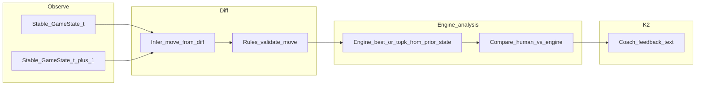
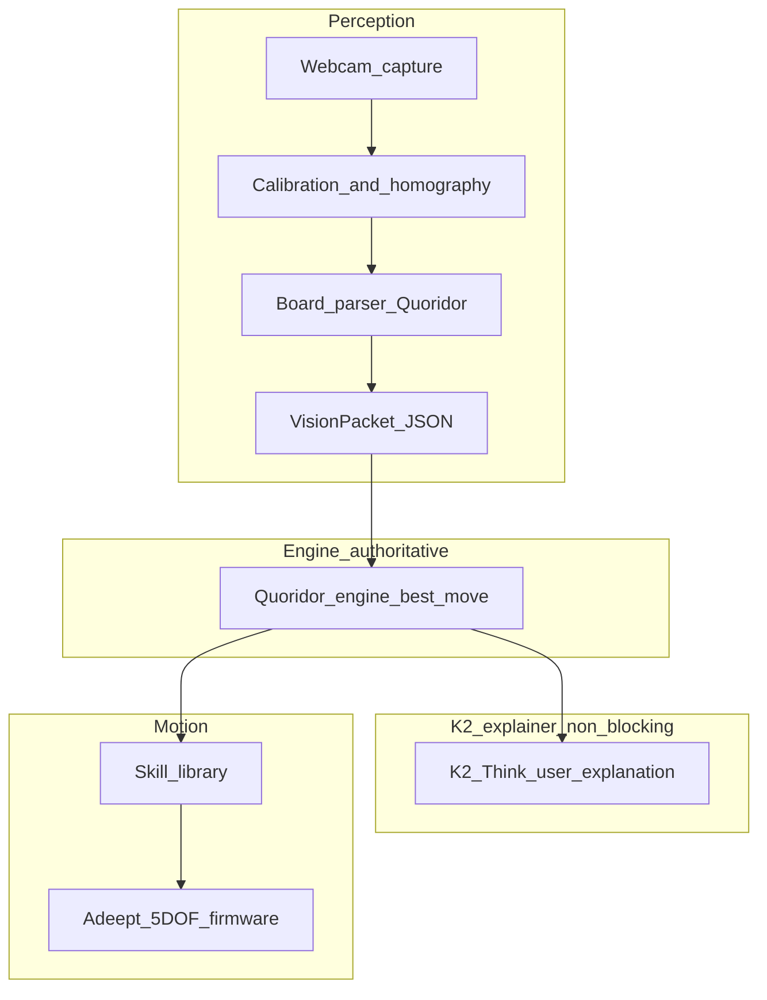

# Quoridor demo: feasibility and build framework

This document evaluates using **Quoridor** as the flagship demo for a webcam-driven, robot-arm platform with a reasoning model (e.g. K2 Think) plus optional game engines. It is written for workshop planning: **what is hard, what is tractable, and how to partition the system** so you can swap backends later.

**Parallel development:** for **three human owners**, **repo layout**, **contracts**, **integration gates**, **AI agent onboarding**, and **merge-conflict avoidance**, see [quoridor-workstreams-and-contracts.md](quoridor-workstreams-and-contracts.md) (§0.4 **ask Owner + confirm intent before coding**). **Agents:** start at [AGENTS.md](AGENTS.md) (mandatory **before** implementing).

---

## 0. Locked setup (this project)

These parameters are **decided** for the current build; other sections still describe alternatives for context.

| Topic                    | Choice                                                                                                                                                                                                                                                       |
| ------------------------ | ------------------------------------------------------------------------------------------------------------------------------------------------------------------------------------------------------------------------------------------------------------ |
| **Board**                | Commercial Quoridor set; **small physical mods allowed** (tape, velcro, markers) to help vision and grasp                                                                                                                                                    |
| **Cameras**              | **One** fixed webcam (top-down or steep angle; see below)                                                                                                                                                                                                    |
| **Arm**                  | **Adeept 5 DOF** (hobby servos, limited reach and repeatability—plan motion accordingly)                                                                                                                                                                     |
| **Policy / “best move”** | **Existing Quoridor engine** (authoritative for move selection and legality)                                                                                                                                                                                 |
| **K2 Think**             | **Narration and pedagogy**: explain the bot’s engine-chosen moves; optional **Coach mode** that comments on the **human’s** moves using engine analysis + K2 teaching voice (see Section 5.7). K2 does **not** override the engine’s move choice for the bot |

**Architecture implication:** the **critical path** is `vision → GameState → engine → RobotJob`. K2 runs **after** the engine has emitted a move (and optional alternates), and can run **in parallel** with arm motion so explanation does not block execution. **Coach mode** adds a parallel path when a **human** moves: `vision → infer move → engine analysis → K2 feedback` (no robot job).

**Single-camera note:** one top-down view is enough for homography-based board state **if** glare is controlled. Avoid needing a second camera for depth by keeping **pawn moves** mostly planar and using **mechanical** aids (tape/velcro) instead of vision-based grasp verification where possible.

### 0.1 Practical board tweaks (recommended)

Use mods that help **classification** and **grip** without changing official rules:

- **Pawn grip:** small **velcro** coin or soft pad on the **top** of each pawn (or tape tab the gripper can pinch) so the Adeept gripper can lift reliably without squeezing the whole barrel.
- **Pawn identity:** if wood colors are ambiguous under your light, add a **thin colored ring** of tape on each pawn (e.g. warm vs cool) consistent with P1/P2—still readable as “the two official pawns” for a demo.
- **Board localization:** optional **ArUco** markers taped to **non-playing** board edges or the table outside the grid (not on squares) to stabilize homography if the wood grain is symmetric.
- **Lighting:** commercial boards are often **slightly glossy**; use **diffuse** desk lighting from multiple sides to kill specular hotspots in grooves.

### 0.2 Adeept 5 DOF: what to expect

Typical educational 5 DOF arms are **short reach**, **servo backlash**, and **limited Z repeatability**. For Quoridor:

- **Pawn moves:** feasible if you stay in a **small workspace** over the board, move slowly, and use **skills** (hover → descend → grip/release) tuned once per session.
- **Wall pick-and-place into grooves:** often **much harder** than pawns (thin part, tight slot, vertical insertion). Treat **full wall automation** as stretch; keep **human-placed walls** or **UI fallback** ready for the demo unless you have time to build jigs.

---

## 1. Rules snapshot (what the software must model)

**Two-player (recommended for demo)**

- **Board:** 9×9 squares (81 cells).
- **Pawns:** Player 1 starts at **e1**, Player 2 at **e9** (algebraic: columns a–i, rows 1–9 from P1’s bottom to top).
- **Walls:** **20** walls total, **10 per player**. Each wall spans **two** adjacent squares, placed in **grooves** between squares. Placed walls never move.
- **Turn:** Either **move pawn** (orthogonal; jumping rules per official rules) **or** **place one wall** (if that player has walls left), subject to legality.
- **Legality constraint that matters for code:** a wall may not be placed if it **fully cuts off** any pawn’s **only** path to its goal edge (path must remain for all pawns).

**Implications for engineering**

- **Discrete state:** pawn coordinates + set of placed walls + walls remaining per player (or derive remaining from count of placed walls per side if you track stock).
- **Move generator:** must combine pawn moves (with jumps) and wall placements, and **reject** placements that violate the “no full block” rule (typically via **shortest-path / reachability** checks on a grid graph).

---

## 2. Feasibility verdict (thorough)

### 2.1 Rules, legality, and “optimal play” — **feasible**

- The game is **fully observable** and **deterministic** under perfect information.
- **Legal-move generation** is a modest graph / rules problem if you represent walls as **blocked edges** between cells (or equivalent).
- **Strong policy** does not require an LLM: **Minimax / alpha–beta**, **MCTS**, or **iterative deepening** with a heuristic (shortest path length, wall pressure, etc.) are standard approaches. Several **open-source Python** implementations exist (quality varies); you can also implement a minimal engine against the official rules for reliability.

**Caveat:** “Perfect” Quoridor at arbitrary depth is computationally non-trivial, but a **hackathon-strong bot** only needs **good + legal**, not world-champion.

**K2 Think’s sweet spot here (aligned with this project):** **explain** the engine’s chosen move to the user (strategy, threats, alternatives the engine considered). Optionally help **disambiguate vision** when you pass **textual** candidates—never replace reachability checks.

### 2.2 Perception from a single webcam — **feasible with scope control; walls are the hard part**

| Subproblem                            | Difficulty    | Notes                                                                                                                                   |
| ------------------------------------- | ------------- | --------------------------------------------------------------------------------------------------------------------------------------- |
| **Board localization + homography**   | Moderate      | Fixed mount + ArUco corners or taped ROI + calibration. Standard practice.                                                              |
| **Pawn positions (2 pawns)**          | Moderate      | Two large pegs on high-contrast squares: color or template matching after grid warp. Occlusion rare from top-down view.                 |
| **Occupied wall slots + orientation** | **High**      | Many **identical** thin walls; **many possible slots**; grooves can **shadow/glare**; small errors flip **h vs v** or wrong groove.     |
| **Turn / “move completed” detection** | Moderate      | Frame differencing + **stability gate** (same parsed state for N frames). Human “hovering” over the board is a failure mode.            |
| **Stock counts**                      | Moderate–high | If walls are stored in piles off-board, counting from one camera is noisy. Easier if each player has a **fixed rack** with clear slots. |

**Bottom line:** Vision for **“where are the two pawns?”** is a reasonable hackathon target. Vision for **“exactly which wall slots are filled, with orientation”** is doable but tends to **consume** your schedule unless you **control the physical setup** aggressively (lighting, board choice, camera height, possibly **marker dots** near grooves for slot IDs in a prototype).

### 2.3 Manipulation with a hobby robot arm — **often the real bottleneck**

| Action                                        | Difficulty | Why                                                                                                                                            |
| --------------------------------------------- | ---------- | ---------------------------------------------------------------------------------------------------------------------------------------------- |
| **Slide pawn orthogonally**                   | Moderate   | Pick-and-place or push; needs repeatable Z and anti-slip.                                                                                      |
| **Pick wall from stock and insert in groove** | **High**   | Thin part, tight tolerance, **vertical insertion**, risk of jamming or wedging; may need **tooling** (funnel, compliant grip, vibrate-settle). |

**Critical feasibility fork (choose explicitly for the demo):**

1. **Full autonomy (pawn + walls):** best story; highest integration risk.
2. **Bot moves pawn only; human places walls** (or vice versa): still demonstrates vision + planning + manipulation for **part** of the game.
3. **“Digital wall” hybrid:** physical pawns, wall placements entered via UI for the opponent only—**not** ideal for a “pure physical” story but saves the demo if manipulation slips.

### 2.4 End-to-end latency and judge experience — **feasible**

- Webcam at 30 fps is enough if your state parser runs at **1–5 Hz** with stability gating.
- The arm motion dominates wall-clock time; plan **spoken narration** or on-screen reasoning from K2 while the arm moves.

---

## 3. Risk matrix (what actually fails in practice)

1. **Groove insertion failures** (walls): mechanical + control; plan retries and **safe backoff** poses.
2. **Wall misreads** (vision): single-bit errors are catastrophic (illegal engine state); require **validation + recovery** (re-capture, human confirm).
3. **Path-blocking rule:** engine must reject illegal walls; never trust an LLM for **reachability**.
4. **Jump rules:** easy to get subtly wrong in code; **property-test** small positions against a reference implementation if possible.
5. **Lighting:** glossy boards and shadows break edge-based slot detectors; **diffuse light** and **matte board** help more than a bigger model.
6. **Coach mode UX:** feedback that is **accurate but harsh** or **wrong due to vision** damages trust; throttle verbosity and offer **“vision uncertain”** escape hatches.

---

## 4. Recommended demo scopes (pick one for the hackathon)

| Scope                                   | Vision                                                                | Motion                            | Story                                                                                                 |
| --------------------------------------- | --------------------------------------------------------------------- | --------------------------------- | ----------------------------------------------------------------------------------------------------- |
| **A – Minimum viable “Quoridor brain”** | Board + **pawns only**; walls from **UI** or human verbal confirm     | Pawn moves only                   | Proves CV → rules → K2 narrative without wall CV                                                      |
| **B – Target demo**                     | Pawns + **wall slot occupancy** (binary per legal slot + orientation) | Pawn + wall place                 | Full game; needs solid lighting and tuning                                                            |
| **C – Ambitious**                       | B + **automatic stock counts** from racks                             | B                                 | Polished; high integration load                                                                       |
| **Coach add-on** (any of A–C)           | Same vision as base scope                                             | Arm idle or opponent is human/bot | **K2 coach** comments on **human** moves using **engine comparison** (Section 4.1); no extra hardware |

**Recommendation:** Plan **B**, implement **fallback to A** if wall vision or insertion slips on day two. Add **Coach** as a **mode flag** once base `GameState` differencing is reliable.

---

## 4.1 Coach mode (watch human + teach)

**Goal:** While a **human** plays (vs another human or vs the bot), the system **observes** the board and, after each **completed, legal** human move, offers **short educational feedback**—strategy concepts, alternatives, and “what a strong engine would lean toward here,” without replacing your engine for legality.

**Why it fits K2:** coaching is inherently **natural language** and **pedagogical** (analogies, priorities, what to notice next). The **engine** supplies **grounded** comparisons so K2 is not inventing “best moves” from nothing.

### 4.1.1 Operating modes

| Mode                     | Who moves physically                        | Coach output                                                                                        |
| ------------------------ | ------------------------------------------- | --------------------------------------------------------------------------------------------------- |
| **Coach + PvP**          | Two humans at the board; arm idle or parked | Feedback targets the player who **just moved** (config: “coach P1” / “coach P2” / both with labels) |
| **Coach + human vs bot** | Human and arm alternate                     | Feedback only on **human** turns (avoid narrating the bot’s own turn twice)                         |

Implement as a **session config**: `coaching_enabled`, `coached_player` (`P1`/`P2`/`both`), `verbosity`, `min_move_interval_s`.

### 4.1.2 Pipeline (no robot on the coached turn)

1. **Commit** `State_before` after stability (end of previous turn).
2. Wait until the board **changes** and **restabilizes** → `State_after`.
3. **Infer move** m: diff `State_before` → `State_after` (should be exactly one legal move for the side that moved; if ambiguous, **pause** and ask human to confirm—do not coach garbage).
4. **Engine** from `State_before`, for the **moving player**: compute **best move** (and ideally **top-k** moves with scores or shallow eval if your engine exposes it).
5. **Structured coaching payload** to K2, e.g. `{ state_before, human_move: m, engine_best, topk, equality_or_worse: ... }`.
6. **K2** generates **coach copy**: supportive tone, 1–3 bullets max for demo, tie feedback to **concepts** (path length, wall bank, tempo).

**Invariant:** classification of “good / dubious” is **engine-backed** (match, or within eval band, or top-k membership). K2 **colors** the explanation; it does not redefine optimality.

### 4.1.3 Engine hooks you want for coaching

- **Legal move check** on inferred m; if illegal, **no coach**—show “rules issue / vision issue” and offer fix.
- **Best move** from prior state for the side to move.
- Optional: **multi-PV** or **top-k** list; optional **static eval** before/after if cheap.

If the engine only returns one best move with no eval, you can still coach: “Engine prefers X; you played Y”—and let K2 describe **typical ideas** behind X without claiming a numeric centipawn loss (unless you have numbers).

### 4.1.4 UX and pedagogy safeguards

- **Verbosity:** `low` (one sentence) vs `medium` (two sentences + one alternative) vs `teach` (short paragraph)—default **low** for live demo.
- **Cooldown:** optional minimum seconds between coach messages so it does not **spam** during thinking.
- **Tone:** system prompt emphasizes **growth mindset** (“a common idea here is…”, “one other plan is…”)—not “bad move.”
- **Vision humility:** if `confidence` from vision is low or diff is ambiguous, say **“I’m not sure the board was read correctly—tap confirm”** instead of strategic critique.
- **Blunder threshold (optional):** only expand feedback when human move is **not** in engine top-k (requires top-k API).

### 4.1.5 Feasibility

- **No new sensors:** same webcam + `GameState` pipeline.
- **Extra failure mode:** inferred human move wrong → bad coaching. Mitigate with **strict diff validation** and **confirm** on mismatch.
- **Latency:** coaching can run **after** the human has released the piece; async is fine.

---

## 5. System framework (how to build the parts)

### 5.1 Layered architecture

**Invariants**

- `VisionPacket` → **normalize** → `GameState` → **engine** returns the **chosen move** (and optionally PV / eval / top-k for K2). **Legality** lives entirely in the engine.
- **K2** consumes **structured** context (FEN-like state or your JSON, chosen move, optional alternates)—**not** raw pixels as the primary input.
- Execution does **not** wait on K2; generate explanation in parallel or queue it for display after the first token.

### 5.2 Data contracts (workshop-friendly)

Define stable JSON schemas (names illustrative):

`**GameState`**

- `pawns`: `{ "P1": "e4", "P2": "e6" }` (or integer coordinates internal).
- `walls`: list of moves in a canonical form, e.g. `{ "square": "e3", "ori": "v" }` per your notation convention (must match engine).
- `walls_remaining`: `{ "P1": 7, "P2": 8 }` or derive from placed count + starting 10.
- `side_to_move`: `"P1" | "P2"`.
- `phase`: `"playing" | "finished"` and `winner` if done.

`**VisionPacket**`

- `state_hypothesis`: `GameState` or **null** if parsing failed.
- `confidence`: float 0–1.
- `per_cell` / `per_slot` diagnostics as needed (for debugging).
- `stable`: bool (passed stability gate).

`**EngineMove`** (examples)

- Pawn: `{ "type": "move_pawn", "to": "e5" }`
- Wall: `{ "type": "place_wall", "square": "d4", "ori": "h" }`

`**RobotJob**`

- `primitive`: `move_pawn | place_wall | home`
- Parameters: source/target in **board frame** (cell ids) + slot id for walls + approach vector enum.

Keep **one** authoritative mapping from **engine notation** ↔ **robot cell indices** ↔ **pixel homography**.

### 5.3 Perception pipeline (webcam-specific)

1. **Capture:** OpenCV / PyAV; lock exposure if possible to reduce flicker.
2. **Undistort (optional):** camera matrix from quick calibration.
3. **Board pose:** ArUco on board frame or desk; compute **homography** H: image → 9×9 normalized square.
4. **Pawn detection:** For each frame (or every k-th), warp board; sample cell centers; classify **empty / P1 / P2** by color or small classifier trained on your pieces.
5. **Wall detection (if in scope):**
  - **Geometry-first:** for each candidate **slot** (precomputed polygon along groove midlines), classify **occupied vs empty**; if occupied, classify **horizontal vs vertical** from line direction energy or small CNN patch.
  - **Change detection:** after stable opponent turn, **diff** against previous committed state to limit which slots must be re-inferred.
6. **Stability gate:** require **N** consecutive frames with identical discrete `GameState` before publishing.
7. **Validation:** run **rules** on parsed state; if illegal, **hold** and retry capture or request human correction.

**Tip:** Commercial boards are usable; reduce glare as in Section 0. If you ever print a test board, prefer **matte** finish and avoid glass covers.

### 5.4 Policy layer (locked for this project)

**Chosen approach:** use your **existing Quoridor engine** for **move selection** (and legal-move filtering if the engine exposes it). Treat the engine as the **single source of truth** for what move the robot will execute.

**K2 integration (primary): explainer (bot move)**

- **Inputs to K2 (text):** current `GameState` (serialized), **chosen move** from the engine, optional **runner-up moves** with engine scores, and a one-line **phase** (“opening”, “midgame”, “endgame”) if you want.
- **Output:** short **user-facing** explanation (why this move, what it threatens, what it prepares). Optionally a **judge mode** with slightly more formal tone.
- **Optional:** ask K2 to produce **two tiers**—one sentence for on-screen UI, one short paragraph if you have a voice line later.

**K2 integration (Coach mode):** separate **system prompt** focused on **teaching**—use the structured payload in Section 5.7 (`CoachEvent`). Do not mix bot-explainer and coach templates in the same call unless you label the role clearly.

**Other patterns (optional later)**

- **Selector:** engine returns **top-k** → K2 picks for “style”—**not** the default here; keeps the story “engine optimal, K2 explains.”
- **Recovery:** on vision conflict, K2 can suggest **human-readable** recovery steps **after** your code has decided to pause (still no physics or legality inside the LLM).

### 5.5 Motion layer (skills, not generated firmware)

Predefine **skills** parameterized by calibration:

- `home`
- `hover_cell(cell_id)`
- `grip_pawn()` / `release_pawn()`
- `move_pawn(from_cell, to_cell)` implemented as pick–place or compliant push
- `pick_wall_from_rack(player, slot_index)` (if automating walls)
- `insert_wall(slot_id, orientation)` with **slow approach**, **stall detection**, and **abort pose**

**Do not** rely on an LLM to emit arbitrary Arduino each turn; if you use codegen, restrict it to **offline** skill authoring with tests.

### 5.6 Software stack (placeholders — team choice)

| Layer          | Sensible options                                                           |
| -------------- | -------------------------------------------------------------------------- |
| Vision runtime | Python 3.11+ with **OpenCV**; optional **PyTorch** for a tiny classifier   |
| IPC            | Same process at first; later **ZeroMQ** / **MQTT** / **ROS 2** if split    |
| Engine         | Embedded Python module **or** subprocess with JSON stdin/stdout            |
| LLM API        | Sponsor-provided K2 endpoint if available; else local stub for dev         |
| Control        | **Arduino**/**ESP32** serial from Python host, or host on **Raspberry Pi** |

### 5.7 Coach mode (integration summary)

Full behavior and UX are in **Section 4.1**. Here: **contracts** and how it sits beside the bot stack.

`**CoachEvent`** (emitted after a human move is inferred and validated)

- `state_before`, `state_after`, `inferred_move` (canonical engine notation)
- `moving_player`: `P1` | `P2`
- `engine_best`, optional `engine_topk[]`, optional `eval_delta` if available
- `vision_confidence`, `diff_ambiguous`: bool

`**CoachFeedback**` (K2 output)

- `summary_line` (required)
- `teaching_points[]` (0–2 short strings; omit if `verbosity=low`)
- `safety_note` if vision uncertain (human-readable; no strategy)

**Orchestration**

- **Session FSM:** `IDLE` → (human/bot turn) → on **stable state change** on a human move with `coaching_enabled`, enqueue `CoachEvent`; do not block physical play.
- **Shared code:** move inference uses the same **diff + rules validate** path you need for **any** human move in human-vs-bot mode (even without coaching), so implement once.

---

## 6. Build order (parallelizable)

1. **Simulator + engine:** CLI “play Quoridor” with strict rules tests (jumps, illegal wall).
2. **Manual arm skills** on the physical board (human types cell moves).
3. **Webcam homography + pawn-only state** with stability gate.
4. **Close the loop:** vision → engine → pawn motion.
5. **Add wall perception** OR **UI wall entry** as per chosen scope.
6. **Wall manipulation** last (or never in scope A).
7. **Coach mode (optional):** implement **move-from-diff** + engine **best vs human** comparison; add K2 coach prompts and **verbosity** controls; test in **PvP** with arm parked before combining with bot mode.

---

## 7. Open decisions (remaining)

**Already decided:** commercial board + single webcam + Adeept 5 DOF + **engine picks moves** + **K2 explains** (Sections 0 and 5.4).

**Still to decide**

- **Demo scope:** A, B, or C (Section 4)—especially whether **wall state** comes from vision or **human/UI** for v1.
- **Engine integration:** in-process module vs subprocess; exact **move notation** string format shared with `RobotJob`.
- **Compute:** laptop-only vs edge device for camera pipeline (either is fine with one webcam).
- **Camera mount:** rigid top-down vs slight angle (angle works if homography is calibrated; top-down simplifies wall shadows).
- **Coach defaults:** coached player (`P1`/`P2`/`both`), default **verbosity**, and whether to coach only when human move **≠** engine best vs every move.

---

## 8. Summary

**Quoridor is a strong *intellectual* demo** (interesting strategy, clear rules). With your chosen split—**engine for optimal play, K2 for explanation**—the reasoning model is **easy to justify to judges**: it makes the bot’s play legible without weakening the claim that moves are **engine-optimal**.

**Coach mode** extends that story: K2 becomes a **teacher**, but **grounding** still comes from the **engine** (best move / top-k vs what the human played). Same webcam; main new risk is **wrong inferred move** → misleading advice—mitigate with **validation**, **low confidence → no critique**, and **supportive** copy.

**Physically**, it remains **harder than pawn-only games** because of **walls** (vision + insertion). The **Adeept 5 DOF** arm reinforces that: **prioritize reliable pawn skills** and treat **wall automation** as stretch. **Velcro/tape** on pawns is aligned with that reality.

The highest-return remaining decision is **scope A vs B** for walls (vision + motion vs pawn-first with UI/human walls).